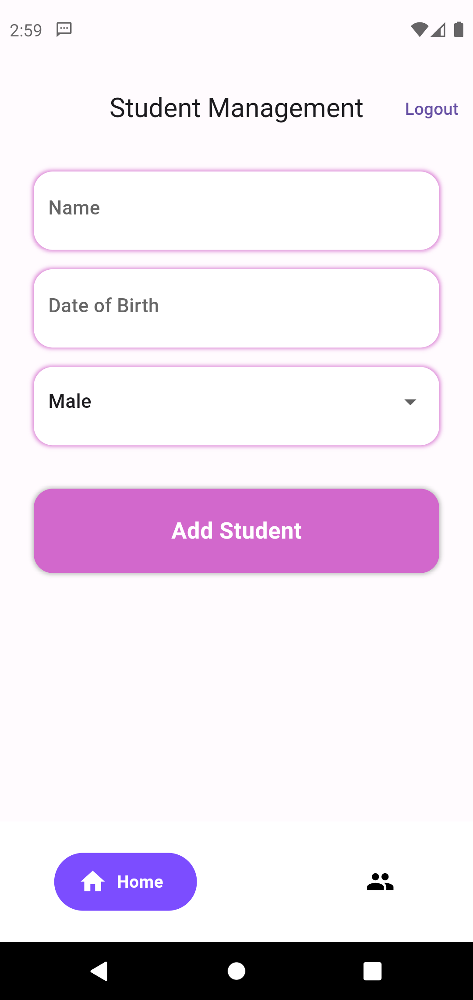
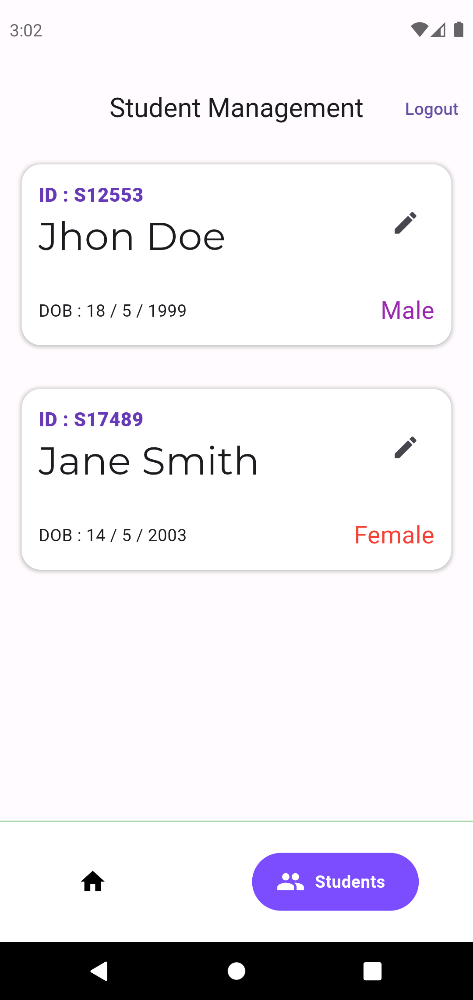

# Flutter Student Management App

## 📋 Index

- [📖 Overview](#-overview)
- [✨ Features](#-features)
- [📷 Screenshots](#-screenshots)
- [🚀 Installation Guide](#-installation-guide)
  - [🔧 Prerequisites](#-prerequisites)
  - [🛠️ Steps](#️-steps)
- [🤝 Contributing](#-contributing)
- [📜 License](#-license)
- [📧 Contact](#-contact)

## 📖 Overview

Welcome to the Flutter Student Management App! This application is designed to help manage student information efficiently and securely. The app includes two primary features:

1. **Manage Student**: Add, update, and view student details.
2. **User Authentication**: Secure login and registration with email verification.

## ✨ Features

- **Manage Student**: 
  - Add new student records.
  - Update existing student information.
  - View a list of all students with detailed information.

- **User Authentication**: 
  - User registration and login.
  - Email verification for new users.
  - Secure password handling.

## 📷 Screenshots

<p align="center">
  
  
</p>

## 🚀 Installation Guide

Follow these steps to set up and run the Flutter Student Management App on your local machine.

### 🔧 Prerequisites

Ensure you have the following installed:
- Flutter SDK: [Flutter Installation Guide](https://flutter.dev/docs/get-started/install)
- Dart SDK (comes with Flutter)
- An IDE with Flutter support (VS Code, Android Studio, etc.)

### 🛠️ Steps

1. **Clone the Repository**:
    ```bash
    git clone https://github.com/your-username/flutter-student-management-app.git
    cd flutter-student-management-app
    ```

2. **Install Dependencies**:
    ```bash
    flutter pub get
    ```

3. **Set Up Firebase**:
    - Go to [Firebase Console](https://console.firebase.google.com/).
    - Create a new project.
    - Add an Android/iOS app to your Firebase project.
    - Follow the instructions to download `google-services.json` (for Android) or `GoogleService-Info.plist` (for iOS).
    - Place the `google-services.json` file in the `android/app` directory.
    - Place the `GoogleService-Info.plist` file in the `ios/Runner` directory.

4. **Update Firebase Configuration**:
    - Open `android/build.gradle` and add the classpath to the `dependencies` section:
        ```gradle
        classpath 'com.google.gms:google-services:4.3.10'
        ```
    - Open `android/app/build.gradle` and add the following line at the bottom of the file:
        ```gradle
        apply plugin: 'com.google.gms.google-services'
        ```
    - For iOS, ensure your `ios/Runner/Info.plist` contains the necessary configurations.

5. **Run the App**:
    ```bash
    flutter run
    ```

## 🤝 Contributing

Contributions are welcome! Please fork this repository and submit a pull request for any features, bug fixes, or enhancements.

## 📜 License

This project is licensed under the MIT License - see the [LICENSE](LICENSE) file for details.

## 📧 Contact

If you have any questions or feedback, feel free to contact me at [work.kuntalgain@gmail.com].

---

Thank you for using the Flutter Student Management App!
